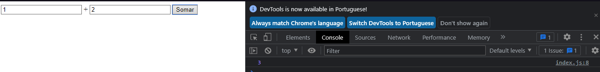

# Instalando Compilador e Primeiro Código TypeScript
---
## Instalando Compilador

Para instalar o compilador, devido ser um superset do JavaScript, ele é compilado para ES5, assim que qualquer código JavaScript também pode ser utilizado em conjunto ou convertido com TypeScript

> Para Instalar o TypeScript
>> - Globalmente : `npm install -g typescript`
>> - No Próprio Projeto : `npm install typescript --save-dev`

---
## Primeiro Código

Iremos utilizar um exemplo em um cenário que o TypeScript é extremamente eficaz.

### Cenário:
O código em .js esta mostrando no console.log, a soma de dois paramêtros e retorna seus valores, após o botão ser clicado e executar a função sum

```js
function sum(a, b){
    return a + b;
}

button.addEventListener("click", function () {
    console.log(sum(input1.value, input2.value));
});
```

### O seguinte problema acontece:

*- O resultado da função deveria ser: **3***

*- E o que foi retornado com a função: **12***


O javascript entende o retorno como string e em vez de fazer a soma, ele somente concatena os valores de string

E o mais curioso, não é retornado nenhum erro, mas o retorno esta diferente de como é esperado.
---
### Resolvendo o problema com TypeScript:

*Iremos agora utilizar a tipagem do ts, iremos tipar os input que recebemos pelo id*
```js
const input1 = document.getElementById("num1") as HTMLInputElement;
const input2 = document.getElementById("num2") as HTMLInputElement;
const button = document.getElementById("button");
```
> Estamos nesse caso definindo que os valores de input 1/2 são Elementos de um input de HTML

Após isso, iremos tipar também nossa função, definindo que os dois paramêtros recebidos vão ser numbers, assim conseguindo fazer a soma dos números e não concatenando os números.
```js
function sum(a: number, b: number){
    return a + b;
}
```

> OBS: O próprio typescript sabe que number com number é uma função de retorno de um número, então não necessita tipar tudo

Do mesmo jeito, iremos Parsear nossos valores dentro da função do click, pois o que recebido do HTMLInputElement é uma string, nesse caso devemos fazer a conversão com o que ele vai ser convertido dentro de Parânteses
```js
button.addEventListener("click", function () {
    console.log(sum(Number(input1.value), Number(input2.value)));
});
```

Lembrete para compilar utilizamos o comando
```bash
tsc index.ts --watch
```
> O watch serve para ficar monitorando e verificando se o arquivo vai possuir algum erro evitando de compilar o mesmo, até ser o mesmo corrigido

---
### Resultado com TypeScript

Após ser compilado e executado, temos a função fazendo seu retorno correto com a soma dos dois paramêtros recebidos




