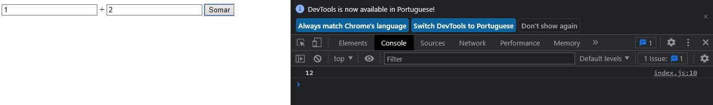

## Instalando Compilador e Primeiro Código TypeScript
---
### Instalando Compilador

Para instalar o compilador, devido ser um superset do JavaScript, ele é compilado para ES5, assim que qualquer código JavaScript também pode ser utilizado em conjunto ou convertido com TypeScript

> Para Instalar o TypeScript
>> - Globalmente : `npm install -g typescript`
>> - No Próprio Projeto : `npm install typescript --save-dev`

---
### Primeiro Código

Iremos utilizar um exemplo em um cenário que o TypeScript é extremamente eficaz.

Cenário:
O código em .js esta mostrando no console.log, a soma de dois paramêtros e retorna seus valores, após o botão ser clicado e executar a função sum

```js
function sum(a, b){
    return a + b;
}

button.addEventListener("click", function () {
    console.log(sum(input1.value, input2.value));
});
```

O seguinte problema acontece:

*O resultado da função deveria ser: **3***
*E o que foi retornado com a função: **12***



O javascript entende o retorno como string e em vez de fazer a soma, ele somente concatenar os valores de string 